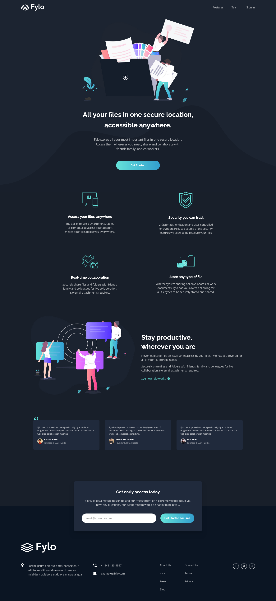

# Frontend Mentor - Fylo dark theme landing page solution

This is a solution to the [Fylo dark theme landing page challenge on Frontend Mentor](https://www.frontendmentor.io/challenges/fylo-dark-theme-landing-page-5ca5f2d21e82137ec91a50fd). Frontend Mentor challenges help you improve your coding skills by building realistic projects.

## Table of contents

- [Overview](#overview)
  - [The challenge](#the-challenge)
  - [Screenshot](#screenshot)
  - [Links](#links)
- [My process](#my-process)
  - [Built with](#built-with)
  - [AI Collaboration](#ai-collaboration)
- [Author](#author)

## Overview

### The challenge

Users should be able to:

- View the optimal layout for the site depending on their device's screen size
- See hover states for all interactive elements on the page

### Screenshots

#### Desktop

#### Mobile

### Links

- Solution URL: [https://github.com/Akiz-Ivanov/fylo-dark-theme-landing-page](https://github.com/Akiz-Ivanov/fylo-dark-theme-landing-page)
- Live Site URL: [https://akiz-ivanov.github.io/fylo-dark-theme-landing-page/](https://akiz-ivanov.github.io/fylo-dark-theme-landing-page/)

## My process

### Built with

- Semantic HTML5 markup
- CSS custom properties
- Flexbox
- CSS Grid
- Mobile-first workflow
- [React](https://reactjs.org/) - JS library
- [Vite](https://vitejs.dev/) - Build tool
- [Tailwind CSS 4.0](https://tailwindcss.com/) - For styles
- [TypeScript](https://www.typescriptlang.org/)

### AI Collaboration

- **Tool used:** Claude (Anthropic)
- **How:** Used throughout the project as a coding partner — discussing component structure, debugging layout issues (curvy SVG background, CallToAction positioning), responsive breakpoint decisions, and accessibility improvements
- **What worked well:** Talking through layout approaches before implementing, catching semantic HTML issues, quick lookups for Tailwind syntax
- **What didn't:** Some layout suggestions needed adjusting once seen in the browser — eyeballing always wins over guessing

## Author

- **Frontend Mentor** - [@Akiz97](https://www.frontendmentor.io/profile/Akiz97)
- **GitHub** - [@Akiz-Ivanov](https://github.com/Akiz-Ivanov)
